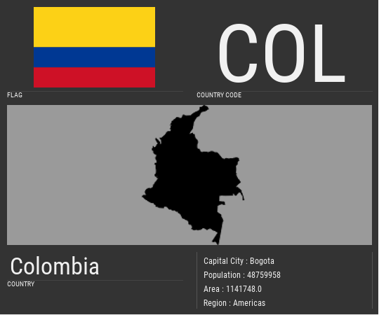

# Country Info Display

### Preliminary Design

### Options
+ Main branch: same as mock up but without image of country in the middle
+ [SVG image branch: same as mock up; uses SVG images for countries](https://github.com/kartikadur/urban-couscous/tree/map-option-svg-image)
+ D3 Viz branch: same as mock up; uses d3Js to visualize country [WIP]

Attributions: 
+ REST API: from [REST Countries](https://restcountries.eu/)
+ SVG MAP ICONS: from Régis Freyd's github repo [MapIcons](https://github.com/djaiss/mapsicon)
+ DESIGN: Ideas from 
  + [Matas Zaloga](https://dribbble.com/matzalog) for [zazu.tv](www.zazu.tv)
  + [Dan Gold](https://dribbble.com/dangold) for [Daily UI Challenge Info Card](https://dribbble.com/shots/3054339-Info-Card-Daily-UI-45)
